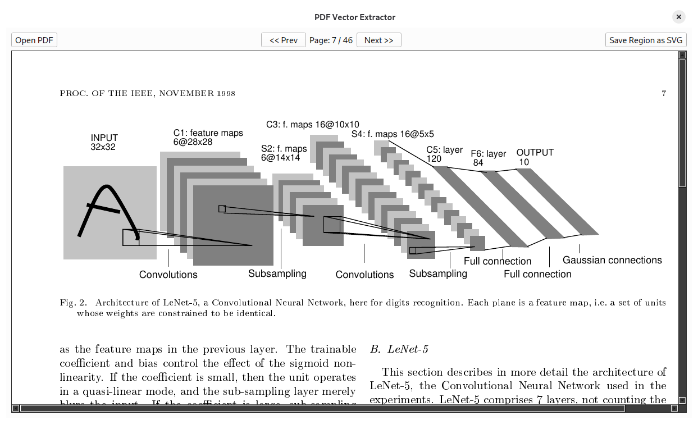
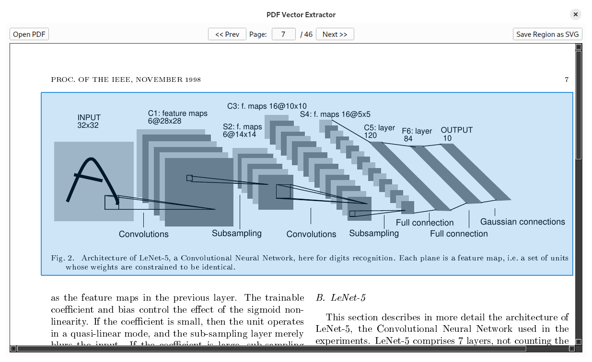
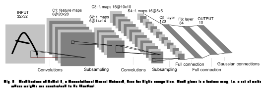

# Extract vectors from PDF to SVG

[![Lint][pdf-extract-svg-lint-badge]][pdf-extract-svg-lint-url]
[![Typecheck][pdf-extract-svg-typecheck-badge]][pdf-extract-svg-typecheck-url]

[pdf-extract-svg-lint-badge]: https://github.com/mbrukman/pdf-extract-svg/actions/workflows/lint.yaml/badge.svg?branch=main
[pdf-extract-svg-lint-url]: https://github.com/mbrukman/pdf-extract-svg/actions/workflows/lint.yaml?query=branch%3Amain
[pdf-extract-svg-typecheck-badge]: https://github.com/mbrukman/pdf-extract-svg/actions/workflows/typecheck.yaml/badge.svg?branch=main
[pdf-extract-svg-typecheck-url]: https://github.com/mbrukman/pdf-extract-svg/actions/workflows/typecheck.yaml?query=branch%3Amain

This app enables extracting regions in a PDF file, such as a diagram, or chart,
or an algorithm, using the vector data in the PDF into an SVG file, which scales
losslessly.

Typical alternative approaches of extracting diagrams and charts from PDF files
(such as research papers) involve taking a screenshot and converting it to a
raster image such as JPG, PNG, WebP, AVIF, or similar, which unfortunately
become pixelated when zooming in or scaling them larger to examine fine-grained
details.

## Table of Contents

* [Usage](#usage)
* [Installation](#installation)
* [Running](#running)
* [Contributing](#contributing)
* [License](#license)
* [Disclaimer](#disclaimer)

## Usage

When you open the app, you will see a blank screen. Click on "Open PDF" button
in the upper left and select a PDF. Once the PDF is opened, you can navigate
pages using "<< Prev" and "Next >>" buttons, or type in a page number and press
Enter to jump to it directly.

Now, you will see the PDF rendered on your screen as follows (this is the LeNet
paper):



You can draw a rectangular selection on the screen by dragging your mouse to
select the region of interest on the page. Once you let go of the mouse button,
you should see something like this:



Now, you can press the button "Save Region as SVG" in the upper-right of the
app to export the selection to a file as SVG. Once saved, you should have a
file that looks like the following:



> [!NOTE]
> Observe that the first two app images above are raster screenshots (PNGs); if
> you zoom in on them, you will see pixelization.
>
> However, the 3rd image is an SVG, which will scale without any pixelization
> arbitrarily.
>
> If you zoom in far enough, you will note that some of the lines don't quite
> match up, but that's not an artifact of the PDF to SVG export process, some
> of the lines in the original LeNet paper don't meet, you can see this in the
> original PDF if you zoom in similarly.

## Installation

* Install CLI tools for querying and managing PDFs

  The script uses `pdftocairo`, `pdftoppm`, and `pdfinfo`.

  Below are commands for various operating systems and distributions with their
  status of testing; if you validate one of the options that's listed as
  untested and it works, please let us know! If you find issues or solutions for
  an environment below, pelase file an issue and let us know as well. Thank you!

  | Operating System             | Commands to install                              | Tested? |
  |------------------------------|--------------------------------------------------|---------|
  | Debian, Ubuntu, etc.         | `sudo apt install poppler-utils`                 | ✅      |
  | RedHat, Fedora, CentOS, etc. | `sudo dnf install poppler-utils`                 | ❌      |
  | Other Linux distributions    | see [Repology][repology]                         | ❌      |
  | macOS                        | install [Homebrew][brew]; `brew install poppler` | ❌      |
  | Other                        | install [Poppler][poppler] from source           | ❌      |

[brew]: https://brew.sh
[poppler]: https://poppler.freedesktop.org
[repology]: https://repology.org/project/poppler/versions

* Create a Python virtual environment and install necessary Python packages

  ```sh
  # Create a new virtual environment
  python -m venv venv

  # Activate the new environment
  source venv/bin/activate

  # Install necessary Python packages
  python -m pip install -r requirements.txt
  ```

## Running

> [!IMPORTANT]
> If you are using virtual environments, you need to use this method of running
> the app.

```sh
python app.py
```

> [!NOTE]
> If you installed PySide6 globally and are not using virtual environments, you
> can just run the script directly.

```sh
# Implicitly uses /usr/bin/python
./app.py
```

## Contributing

See [`CONTRIBUTING.md`](CONTRIBUTING.md) for details.

## License

Apache 2.0; see [`LICENSE`](LICENSE) for details.

## Disclaimer

This is not an officially supported Google product. This project is not
eligible for the [Google Open Source Software Vulnerability Rewards
Program](https://bughunters.google.com/open-source-security).
